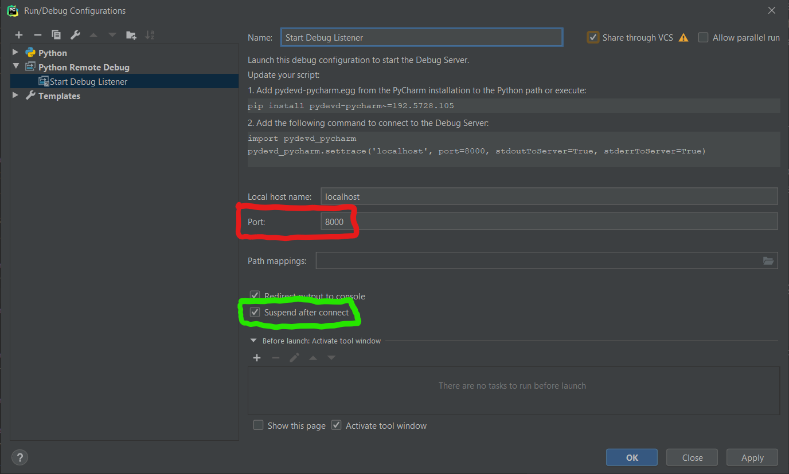

# Debugging Azure Machine Learning run with PyCharm

PyCharm Professional offers a [remote debugging feature](https://www.jetbrains.com/help/pycharm/remote-debugging-with-product.html)
that makes it possible to connect a run that executes in AML Compute with PyCharm running locally.

To do this, we need to:
1. Make minor tweaks to our training script to run `pydevd_pycharm.settrace()`
1. Create a 'Debug Submission' script - that will submit our code to AML Compute
1. Configure the PyCharm Run/Debug Configuration
1. Ensure that the AML Compute cluster has network connection to our local PC
    * In this example, we'll be using [ngrok](https://ngrok.com) - a service creating a secure URL 
    that connects to your localhost

## Instructions

#### 1. Changing the training script
In order to start the debugger during the training run, `pydevd-pycharm.settrace()` must be called with the IP and port
that the debug listener is running on. 

Since we don't want to change the training script between debug runs and non-debug runs, we'll put this in an `if` statement
that checks for the presence of an environment variable to specify debugging. 

The [training script](code/train.py) in this repo is a very simple example based on the [train-on-amlcompute](https://github.com/Azure/MachineLearningNotebooks/blob/master/how-to-use-azureml/training/train-on-amlcompute/train.py)
example from the Azure Machine Learning Notebooks GitHub repo.

#### 2. Creating Debug Submission Script 
The [debug submission script](code/debug-submit.py) will set the required pip packages, set the environment variables needed for the run, and 
submit the script to Azure Machine Learning.

The debug script uses the authentication of the `az` command line and also uses the details of the experiment/folder
that the folder is attached to.

To attach a folder to Azure Machine Learning Services, you can run:

```shell script
az ml folder attach -w AML_WORKSPACE_NAME -e AML_EXPERIMENT_NAME -g AML_WORKSPACE_RESOURCE_GROUP
```

#### 3. Create PyCharm Run/Debug Configuration
The PyCharm Run/Debug Configurations are stored in the repo, there are three different components for the Debug configuration:
1. Python Script for running `debug-submit.py`
1. Start the remote debugger - listening on whichever port you'll set ngrok to

1. Compound Run/Debug Configuration that executes the first two run configs at the same time.

#### 4. Start ngrok Tunnel
The ngrok tunnel is started by running `ngrok tcp 8000` (if using port 8000 in the PyCharm Run/Debug configuration - 
see the red box in the image above.) 

#### 5. Start the Run/Debug Configuration
Select the 'Compound' debug config you created above click Debug (or press Shift+F9)

## Walkthrough Video
You can see a walkthrough of these steps in this YouTube video.
[](https://www.youtube.com/watch?v=MNk8CAsA4po)